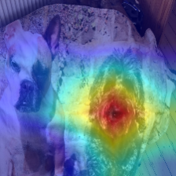
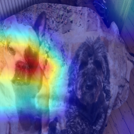

# Dorknet

Artisanal CNNs. 

* Enough building blocks to put together a lot of serious architectures (ResNets, MobileNets etc). 
* GPU support via Cupy (currently mandatory but work in progress to make this optional - CPU-only version uses Cython for critical parts to improve performance)
* Image data augmentation routines, l2 regularisation and 'mixup'
* Class activation maps (CAM) for visualising image regions responsible for predictions
* Work in progress!

## Installation
 
* Python Virtual Environment - you might need to change the version of cupy to match your version of Cuda and/or driver setup. Please check out the cupy installation guides for this, it's pleasingly straightforward.

  `virtualenv -p python3 env`

  `source env/bin/activate`

  `pip install -r requirements.txt`

  Now you can start looking at the examples and adapting them for your data.

* Docker
   * The Docker directory in this repo provides scripts for building and running Dorknet images based on an Intel Python distribution image (which I've found offers a really useful speedup when running in CPU only mode), and an official cupy container. You'll need to adjust paths in volume mappings in the the 'run' scripts to make your datasets visible within the container when running these.

* There is a release with a zip file containing a trained model - the one used in generating the CAM images below.

## Use

Your best bet is to look at the examples and extrapolate.

### Some Class Activation Map outputs

These are produced using a network trained on the 120 dog classes of ImageNet.

Region responsible for class 'Bouvier des Flandres'

Region responsible for class 'Boxer'

## Documentation 

Nothing official, but I'm working on adding more in the source code where appropriate.